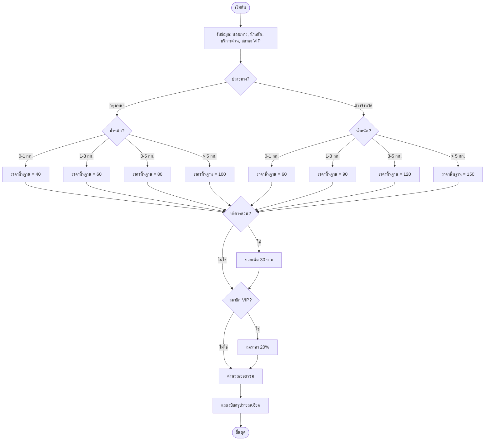

# ระบบคำนวณค่าจัดส่งสินค้า (Shipping Cost Calculator)

โปรแกรมภาษา Java สำหรับคำนวณค่าจัดส่งสินค้าโดยพิจารณาจากปลายทาง, น้ำหนัก, รูปแบบการบริการ และสถานะสมาชิก

## คุณสมบัติของโปรแกรม

- **คำนวณตามพื้นที่**: แยกราคาตามปลายทาง (กรุงเทพฯ และปริมณฑล หรือ ต่างจังหวัด)
- **แยกตามช่วงน้ำหนัก**: เลือกอัตราค่าบริการอัตโนมัติตามน้ำหนักสินค้า (0-5+ กก.)
- **บริการด่วน (Express)**: ตัวเลือกเพิ่มค่าบริการด่วน (+30 บาท)
- **ส่วนลดสมาชิก VIP**: มอบส่วนลด 20% โดยอัตโนมัติสำหรับสมาชิก VIP
- **ระบบโต้ตอบผ่าน Console**: รับข้อมูลจากผู้ใช้และแสดงผลบิลสรุปรายละเอียดที่ชัดเจน

## รายละเอียดการคำนวณ

### 1. อัตราค่าบริการพื้นฐาน

| น้ำหนัก (กก.) | กรุงเทพฯ และปริมณฑล | ต่างจังหวัด |
| :--- | :--- | :--- |
| 0 – 1 | 40 บาท | 60 บาท |
| > 1 – 3 | 60 บาท | 90 บาท |
| > 3 – 5 | 80 บาท | 120 บาท |
| > 5 | 100 บาท | 150 บาท |

### 2. ค่าบริการเพิ่มเติมและส่วนลด
- **บริการด่วน (Express)**: +30 บาท
- **สมาชิก VIP**: ส่วนลด 20% (คำนวณจาก ค่าบริการพื้นฐาน + ค่าบริการด่วน)

## การทำงานของโปรแกรม (How it Works)

โปรแกรมทำงานตามขั้นตอนดังนี้:

1. **รับข้อมูลปลายทาง**: ผู้ใช้เลือกพื้นที่จัดส่ง (1 สำหรับกรุงเทพฯ, 2 สำหรับต่างจังหวัด)
2. **รับข้อมูลน้ำหนัก**: ผู้ใช้ป้อนน้ำหนักสินค้าเป็นกิโลกรัม
3. **ตรวจสอบบริการเสริม**: สอบถามความต้องการบริการด่วน (Express)
4. **ตรวจสอบสถานะสมาชิก**: สอบถามสถานะ VIP เพื่อใช้ในการคำนวณส่วนลด
5. **ประมวลผล**: 
   - โปรแกรมจะหาค่าบริการพื้นฐานจากตารางตามเงื่อนไขพื้นที่และน้ำหนัก
   - รวมค่าบริการด่วน (ถ้ามี)
   - หักส่วนลด 20% หากเป็นสมาชิก VIP
6. **แสดงผล**: แสดงบิลสรุปรายละเอียด (Summary Bill) ที่ประกอบด้วย ค่าส่งพื้นฐาน, ค่าด่วน, ส่วนลด และยอดรวมสุทธิ

## แผนผังการทำงาน (Flowchart)



## วิธีการใช้งาน

1. ตรวจสอบว่าติดตั้ง Java JDK แล้ว
2. คอมไพล์โปรแกรม:
   ```bash
   javac ShippingCalculator.java
   ```
3. รันโปรแกรม:
   ```bash
   java ShippingCalculator
   ```
